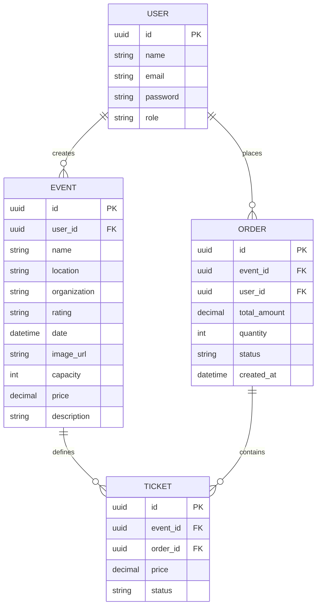
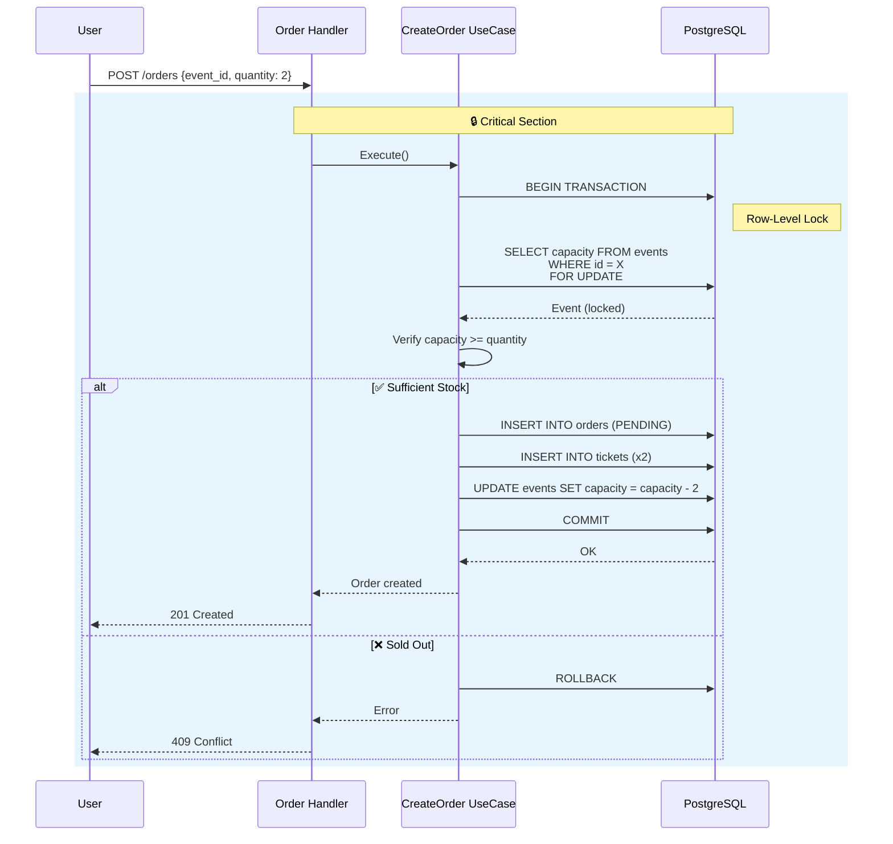

# Documentação de Arquitetura: go-clean-api
## Ticketing System API

---

## 📋 Resumo do Projeto

**go-clean-api** é uma implementação robusta de um Sistema de Venda de Ingressos demonstrando **Clean Architecture**, **Domain-Driven Design (DDD)** e **Test-Driven Development (TDD)** em Go.

### Objetivo Principal
Implementar um sistema de alta concorrência para compra de ingressos onde a consistência de dados é primordial. Serve como referência para lidar com regras de negócio complexas (race conditions, transações atômicas) dentro de uma base de código modular e manutenível.

---

## 🏗️ Visão Geral da Arquitetura

### Padrão: Clean Architecture (Arquitetura Limpa)

O projeto segue os princípios da Clean Architecture com 4 camadas principais, garantindo:
- **Independência de frameworks**
- **Testabilidade** 
- **Independência de UI**
- **Independência de banco de dados**
- **Independência de agentes externos**

### Diagrama de Camadas

```
┌─────────────────────────────────────────────────────────┐
│                    PRESENTATION LAYER                    │
│  (HTTP Handlers, Middlewares, Routes, Swagger)         │
│         ↑                                                │
│         │ Depends on                                      │
├─────────┴───────────────────────────────────────────────┤
│                   USE CASE LAYER                          │
│  (Interactors, Application Business Rules)                │
│         ↑                                                │
│         │ Depends on                                      │
├─────────┴───────────────────────────────────────────────┤
│                   DOMAIN LAYER                            │
│  (Enterprise Business Rules, Entities, Repository)      │
│         ↑                                                │
│         │ Depends on                                      │
├─────────┴───────────────────────────────────────────────┤
│                 INFRASTRUCTURE LAYER                    │
│  (Database, HTTP Framework, External Services)          │
└─────────────────────────────────────────────────────────┘
```

---

## 📁 Estrutura do Projeto

```
go-clean-api/
├── cmd/api/                    # Entrypoint da aplicação
│   └── main.go                 # Ponto de entrada
│
├── internal/
│   ├── domain/                 # 💎 Domínio (Regras de Negócio)
│   │   ├── entity/            # Entidades (User, Event, Order, Ticket)
│   │   ├── repository/        # Interfaces de Repositório
│   │   └── error/             # Erros de domínio
│   │
│   ├── usecase/               # ⚙️ Casos de Uso (Application Rules)
│   │   ├── create_user.go
│   │   ├── login.go
│   │   ├── create_event.go
│   │   ├── create_order.go
│   │   ├── list_events.go
│   │   ├── get_user.go
│   │   ├── list_user_orders.go
│   │   ├── update_order_status.go
│   │   └── interfaces.go      # Contratos de UseCase
│   │
│   └── infra/                 # 🔌 Infraestrutura
│       ├── database/          # Conexão e Transações
│       │   ├── postgres/
│       │   └── transaction.go
│       │
│       ├── http/              # Camada HTTP
│       │   ├── handler/       # HTTP Handlers
│       │   │   ├── auth_handler.go
│       │   │   ├── event_handler.go
│       │   │   ├── order_handler.go
│       │   │   └── user_handler.go
│       │   │
│       │   ├── middleware/    # Middlewares
│       │   │   ├── auth.go
│       │   │   └── role.go
│       │   │
│       │   ├── factories/     # Fábricas de Handlers
│       │   │   ├── auth_handler_factory.go
│       │   │   ├── event_handler_factory.go
│       │   │   ├── order_handler_factory.go
│       │   │   └── user_handler_factory.go
│       │   │
│       │   └── auth/          # Autenticação
│       │       ├── token.go
│       │       └── context.go
│       │
│       └── repository/        # Implementações de Repositório
│           ├── user_repository_sqlx.go
│           ├── event_repository_sqlx.go
│           ├── order_repository_sqlx.go
│           └── model/         # Modelos de DB
│               ├── user.go
│               ├── event.go
│               └── order.go
│
├── test/e2e/                  # 🧪 Testes End-to-End
│   ├── setup_test.go
│   ├── auth_test.go
│   ├── event_test.go
│   └── order_test.go
│
├── sql/migrations/            # 📊 Migrações de Banco
├── docs/                      # 📚 Documentação Swagger
├── Makefile                   # 🛠️ Automação
└── docker-compose.yml         # 🐳 Docker Compose
```

---

## 🎯 Domain-Driven Design (DDD)

### Entidades Principais

#### User (Usuário)
```go
type User struct {
    ID       UUID   // Identificador único
    Name     string
    Email    string
    Password string // Hash Bcrypt
    Role     string // "user" | "admin"
}
```

#### Event (Evento)
```go
type Event struct {
    ID           UUID
    UserID       UUID   // Criador do evento
    Name         string
    Location     string
    Organization string
    Rating       string // Classificação indicativa
    Date         time.Time
    ImageURL     string
    Capacity     int    // Capacidade máxima
    Price        Decimal
    Description  string
}
```

#### Order (Pedido)
```go
type Order struct {
    ID          UUID
    EventID     UUID
    UserID      UUID
    TotalAmount Decimal
    Quantity    int
    Status      string // "PENDING" | "PAID" | "REJECTED"
    CreatedAt   time.Time
}
```

#### Ticket (Ingresso)
```go
type Ticket struct {
    ID      UUID
    EventID UUID
    OrderID UUID
    Price   Decimal
    Status  string // "AVAILABLE" | "SOLD" | "USED"
}
```

### Diagrama de Relacionamentos (ER)



---

## ⚙️ Casos de Uso (UseCases)

### 1. Autenticação
| Caso de Uso | Descrição |
|-------------|-----------|
| `CreateUser` | Registra novo usuário com senha hash |
| `Login` | Autentica usuário e gera JWT |
| `GetUser` | Retorna informações do usuário |

### 2. Eventos
| Caso de Uso | Descrição | Restrição |
|-------------|-----------|-----------|
| `CreateEvent` | Cria novo evento | Admin apenas |
| `ListEvents` | Lista todos eventos disponíveis | Público |
| `ListUserEvents` | Lista eventos criados pelo usuário | Autenticado |

### 3. Pedidos (Orders)
| Caso de Uso | Descrição | Observação |
|-------------|-----------|------------|
| `CreateOrder` | Compra ingressos para evento | Transação atômica |
| `ListUserOrders` | Lista pedidos do usuário | - |
| `UpdateOrderStatus` | Webhook para atualizar status | Validação de secret |

---

## 🔒 Segurança e Autorização

### RBAC (Role-Based Access Control)

```
┌────────────────────────────────────────┐
│             ROLES                       │
├────────────────────────────────────────┤
│  👤 USER                                │
│     ├── Signup/Login                    │
│     ├── Ver eventos                     │
│     ├── Comprar ingressos               │
│     └── Ver próprios pedidos            │
├────────────────────────────────────────┤
│  👑 ADMIN                               │
│     ├── Tudo do USER                    │
│     └── Criar eventos                   │
└────────────────────────────────────────┘
```

### JWT Token
- **Biblioteca**: `golang-jwt/jwt/v5`
- **Claims**: UserID, Email, Role
- **Expiry**: Configurável via env

### Middleware de Autenticação
1. Extrai token do header `Authorization: Bearer <token>`
2. Valida assinatura JWT
3. Injeta User no contexto do request

### Middleware de Role
1. Verifica role no contexto
2. Rejeita se não tiver permissão

---

## 🗄️ Persistência de Dados

### Banco de Dados: PostgreSQL
- **Driver**: `pgx` (nativo)
- **Helper**: `sqlx` (queries structuradas)
- **Migrations**: Goose

### Transações
Suporte a transações atômicas para operações críticas:
```go
// Exemplo: Compra de ingressos
BEGIN TRANSACTION
    SELECT capacity FROM events WHERE id = X FOR UPDATE  -- Lock row
    INSERT INTO orders (PENDING)
    INSERT INTO tickets (x2)
COMMIT
```

### Padrão Repository
- **Interface** no Domain (contrato)
- **Implementação** no Infra (SQLx)
- Permite substituir banco sem alterar regras de negócio

---

## 🧪 Test-Driven Development (TDD)

### Estratégia de Testes

| Tipo | Cobertura | Ferramenta |
|------|-----------|------------|
| **Unitários** | Componentes isolados | Testify + SQLMock |
| **Integração** | UseCase + Repository | Banco de teste |
| **E2E** | Fluxo completo | HTTP requests reais |

### Organização de Testes
```
test/
├── e2e/
│   ├── setup_test.go      # Configuração e teardown
│   ├── auth_test.go       # Testes de autenticação
│   ├── event_test.go      # Testes de eventos
│   └── order_test.go      # Testes de pedidos
└── ...

internal/
├── usecase/
│   ├── create_user_test.go
│   ├── login_test.go
│   └── ...
└── infra/
    └── http/
        └── handler/
            ├── auth_handler_test.go
            └── ...
```

### Padrão Table-Driven Tests
```go
func TestCreateUser(t *testing.T) {
    tests := []struct {
        name     string
        input    CreateUserInput
        wantErr  bool
    }{
        {"sucesso", inputValido, false},
        {"email duplicado", inputDup, true},
        {"senha curta", inputCurta, true},
    }
    for _, tt := range tests {
        t.Run(tt.name, func(t *testing.T) {
            // test...
        })
    }
}
```

---

## 🔄 Fluxo Crítico: Compra de Ingressos

### Problema: Race Condition
Múltiplos usuários podem tentar comprar os últimos ingressos simultaneamente.

### Solução: Database-Level Locking



---

## 🌐 API Endpoints

### Documentação
- **Swagger**: http://localhost:8080/api/v1/swagger/index.html

### Rotas Públicas
| Método | Endpoint | Descrição |
|--------|----------|-----------|
| POST | `/api/v1/signup` | Registro de usuário |
| POST | `/api/v1/login` | Autenticação |
| GET | `/api/v1/events` | Listar eventos |
| POST | `/api/v1/orders/:id/status` | Webhook status |

### Rotas Protegidas (JWT)
| Método | Endpoint | Descrição |
|--------|----------|-----------|
| GET | `/api/v1/me` | Info do usuário |
| GET | `/api/v1/me/events` | Meus eventos |
| POST | `/api/v1/orders` | Criar pedido |
| GET | `/api/v1/orders` | Meus pedidos |

### Rotas Admin (JWT + Role)
| Método | Endpoint | Descrição |
|--------|----------|-----------|
| POST | `/api/v1/events` | Criar evento |

---

## 🛠️ Stack Tecnológica

| Categoria | Tecnologia | Versão |
|-----------|------------|--------|
| **Linguagem** | Go | 1.25+ |
| **Framework Web** | Gin | latest |
| **Banco de Dados** | PostgreSQL | 15+ |
| **Driver DB** | pgx | v5 |
| **Migrations** | Goose | latest |
| **Autenticação** | JWT | v5 |
| **Hashing** | Bcrypt | - |
| **UUID** | Google UUID | - |
| **Testes** | Testify | - |
| **Mock DB** | SQLMock | - |
| **Linting** | Golangci-lint | - |
| **Hot Reload** | Air | - |
| **Docs** | Swaggo | - |

---

## 🐳 Infraestrutura Docker

### Serviços
```yaml
services:
  api:
    build: .
    ports:
      - "8080:8080"
    environment:
      - DATABASE_URL=postgres://...
      - JWT_SECRET=...
    depends_on:
      - postgres
  
  postgres:
    image: postgres:15-alpine
    environment:
      - POSTGRES_USER=...
      - POSTGRES_PASSWORD=...
      - POSTGRES_DB=...
    volumes:
      - postgres_data:/var/lib/postgresql/data
```

---

## 📋 Comandos Make

| Comando | Descrição |
|---------|-----------|
| `make install` | Instala dependências |
| `make dev` | Inicia com hot-reload |
| `make run` | Inicia produção |
| `make test-unit` | Testes unitários |
| `make test-e2e` | Testes end-to-end |
| `make test-all` | Todos testes |
| `make ci` | Pipeline completo |
| `make migration-new` | Nova migração |
| `make migration-up` | Aplicar migrações |
| `make lint` | Executar linters |

---

## 🎯 Princípios Aplicados

### SOLID
- **S**ingle Responsibility: Cada função/classe tem um propósito único
- **O**pen/Closed: Extensível via interfaces
- **L**iskov Substitution: Repositories intercambiáveis
- **I**nterface Segregation: Interfaces pequenas e focadas
- **D**ependency Inversion: Domain não depende de Infra

### Clean Code
- Nomes revelam intenção
- Funções pequenas (SRP)
- Comentários explicam "por que", não "o que"

### Test-Driven Development
1. 🔴 Red: Escreve teste falhando
2. 🟢 Green: Código mínimo para passar
3. 🔵 Refactor: Melhora qualidade

---

## 📊 Métricas e Qualidade

### Linhas de Código
- **Total Arquivos Go**: ~60 arquivos
- **Camada Domain**: ~9 arquivos
- **Camada UseCase**: ~18 arquivos  
- **Camada Infra**: ~27 arquivos
- **Testes E2E**: ~4 arquivos

### Cobertura de Testes
- Testes Unitários: ✅ Todos use cases
- Testes de Handler: ✅ HTTP handlers
- Testes E2E: ✅ Fluxos principais

---

## 🚀 Próximos Passos / TODO

- [ ] Adicionar endpoint de edição de usuário
- [ ] Adicionar endpoint de edição de evento
- [x] Adicionar campo de descrição no evento
- [ ] Adicionar soft delete de evento
- [ ] Adicionar upload de imagem do evento (cloud storage)
- [ ] Adicionar endpoint de check-in (usando ticket id)

---

## 📚 Referências

- [Clean Architecture - Robert C. Martin](https://8thlight.com/blog/uncle-bob/2012/08/13/the-clean-architecture.html)
- [Domain-Driven Design - Eric Evans](https://domainlanguage.com/ddd/)
- [Go Clean Architecture Template](https://github.com/bxcodec/go-clean-arch)
- [Gin Web Framework](https://gin-gonic.com/)
- [Testify](https://github.com/stretchr/testify)

---

**Documentação gerada automaticamente pelo Hermes Agent**
**Projeto**: go-clean-api / Ticketing System API
**Data**: 2026
