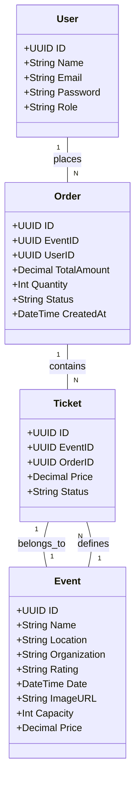
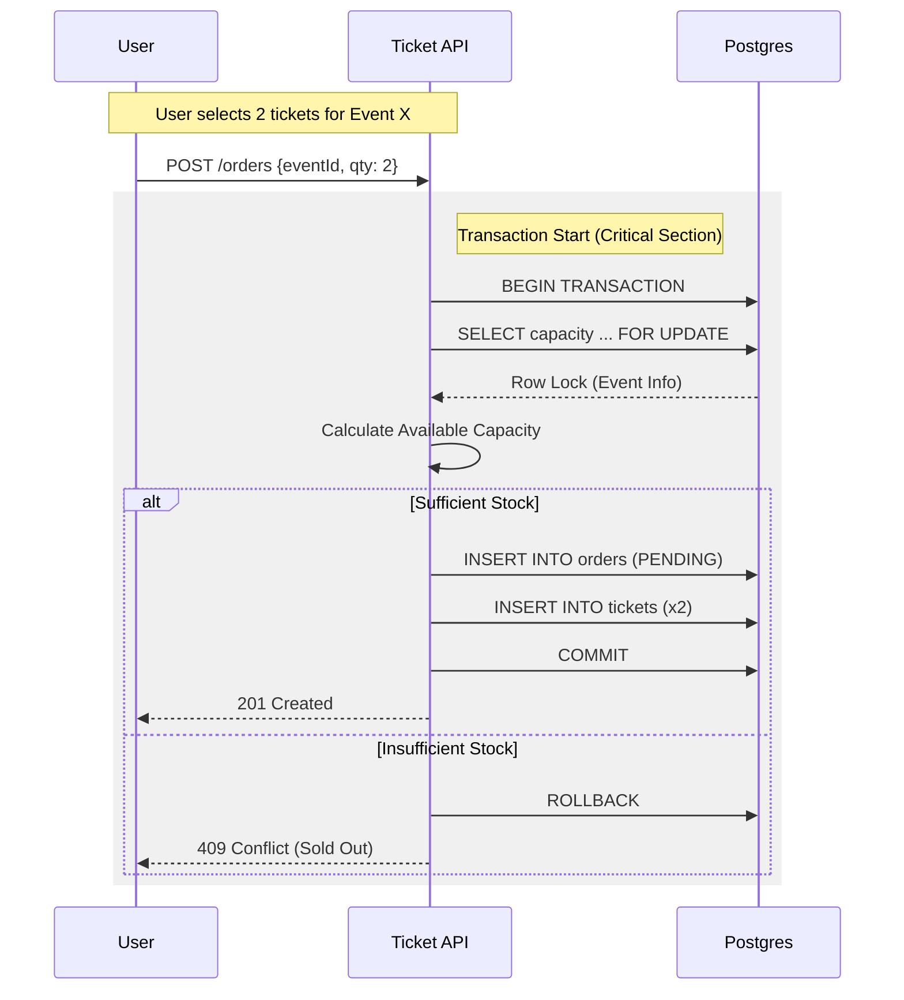

# Ticketing System API

A robust Ticketing System implementation showcasing **Clean Architecture**, **Domain-Driven Design (DDD)**, and **Test-Driven Development (TDD)** in Go.

## 🚀 Overview

This project implements a high-concurrency ticket purchasing system where data consistency is paramount. It serves as a reference for handling complex business rules (e.g., race conditions, atomic transactions) within a maintainable, modular codebase.

**Key Concepts:**

- **Clean Architecture**: Decoupled layers (Domain, UseCase, Infrastructure, Presentation) ensuring testability.
- **DDD (Domain-Driven Design)**: Rich domain models encapsulate business logic (`Order`, `Ticket`).
- **TDD (Test-Driven Development)**: Comprehensive test coverage for all layers.
- **RBAC (Role-Based Access Control)**: Secure access tailored for `User` and `Admin` roles.

## 🛠️ Tech Stack

- **Language**: Go 1.25+
- **Framework**: [Gin](https://github.com/gin-gonic/gin) (HTTP Web Framework)
- **Database**: PostgreSQL (Driver: `pgx`, Helper: `sqlx`)
- **Authentication**: JWT (`golang-jwt/jwt/v5`)
- **Migrations**: Goose
- **Testing**: Testify, SQLMock
- **Utilities**: Google UUID, Bcrypt

## 📂 Project Structure

```text
.
├── cmd/api         # Application entrypoint
├── internal
│   ├── domain      # Enterprise Business Rules (Entities)
│   ├── usecase     # Application Business Rules (Interactors)
│   └── infra       # Frameworks & Drivers
│       ├── database    # DB Connection & Transactions
│       ├── http        # Handlers, Middleware, Routes
│       └── repository  # Data Access Implementation
├── sql/migrations  # Database schema migrations
└── Makefile        # Automation commands
```

## ⚡ Getting Started

### Prerequisites

- Go 1.25+
- Docker & Docker Compose
- Make

### Quick Start

1.  **Start Services**:

    ```bash
    make run
    # OR
    docker-compose up -d
    ```

2.  **Run Migrations**:

    ```bash
    make migration-up
    ```

3.  **Run Tests**:
    ```bash
    make test
    ```

## 📐 Architecture Diagrams

### Domain Model (Class Diagram)



### Purchase Flow (Sequence Diagram)

This diagram illustrates the critical section handling for ticket purchasing to prevent race conditions.



## 🔌 API Routes

**Swagger Documentation**: [http://localhost:8080/api/v1/swagger/index.html](http://localhost:8080/api/v1/swagger/index.html)

### Public Routes

- `POST /api/v1/signup`: Register a new user.
  - **Body**: `{"name": "...", "email": "...", "password": "..."}`
  - **Default Role**: `user`
  - **Response**: `201 Created` with user details
- `POST /api/v1/login`: Authenticate and receive JWT token.
  - **Body**: `{"email": "...", "password": "..."}`
  - **Response**: `200 OK` with `{"token": "..."}`
- `GET /api/v1/events`: List all available events.
  - **Response**: `200 OK` with array of events

### Protected Routes (Requires Authentication)

All protected routes require a valid JWT token in the `Authorization` header:

```
Authorization: Bearer <your-jwt-token>
```

- `GET /api/v1/me`: Get current user information.
  - **Response**: `200 OK` with user details (id, name, email, role)
- `GET /api/v1/me/events`: List events created by the authenticated user.
  - **Response**: `200 OK` with array of user's events
- `POST /api/v1/orders`: Purchase tickets for an event.
  - **Body**: `{"event_id": "uuid", "quantity": 2}`
  - **Response**: `201 Created` with order details
  - **Note**: Handles race conditions with database-level locking
- `GET /api/v1/orders`: List all orders for the authenticated user.
  - **Response**: `200 OK` with array of orders

### Admin Only Routes

These routes require authentication AND the `admin` role:

- `POST /api/v1/events`: Create a new event.
  - **Body**:
    ```json
    {
      "name": "Rock in Rio",
      "location": "Rio de Janeiro",
      "organization": "Live Nation",
      "rating": "Livre",
      "date": "2025-10-10T00:00:00Z",
      "capacity": 100000,
      "price": 100.0,
      "image_url": "http://example.com/image.jpg"
      - **Response**: `201 Created` with event details
    ```

## TODO

- [ ] Add edit user endpoint
- [ ] Add edit event endpoint
- [ ] Add event description field
- [ ] Add soft delete event endpoint
- [ ] Add event image upload endpoint // using cloud storage
- [ ] Add event check-in endpoint // using ticket id
