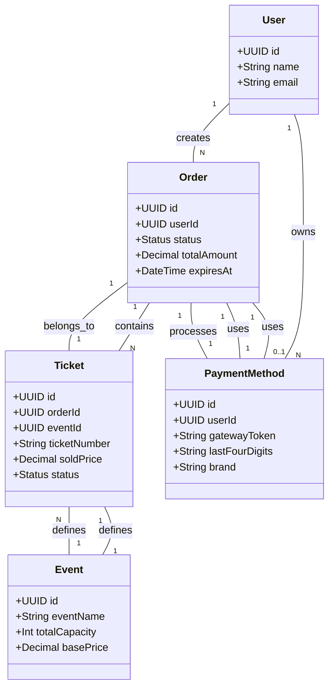
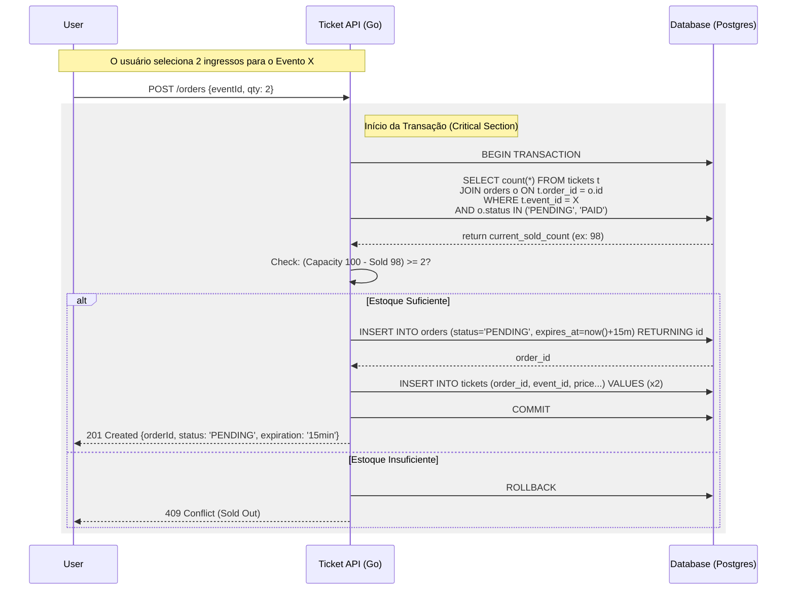

# Go Clean API

A robust Ticketing System implementation showcasing **Clean Architecture**, **Domain-Driven Design (DDD)**, and **Test-Driven Development (TDD)** in Go.

## 🚀 Overview

This project implements a ticket purchasing flow where high concurrency and data consistency are critical. It acts as a reference implementation for handling complex business rules and race conditions (e.g., preventing overselling of tickets) within a clean, maintainable codebase.

**Key Concepts:**

- **Clean Architecture**: Strict separation of concerns to ensure testability and independence from frameworks.
- **DDD (Domain-Driven Design)**: Business logic is encapsulated in rich domain models (`Order`, `Ticket`).
- **TDD (Test-Driven Development)**: Development driven by tests to ensure correctness from the start.

## 🛠️ Tech Stack

- **Language**: Go 1.25+
- **Testing**: `testify` for assertions and suites
- **Linter**: `golangci-lint`
- **Utilities**: `google/uuid`

## 📂 Project Structure

```text
.
├── internal
│   ├── domain    # Enterprise Business Rules (Entities)
│   ├── usecase   # Application Business Rules
│   └── infra     # Frameworks & Drivers (Database, etc.)
├── Makefile      # Automation commands
├── go.mod        # Dependency definitions
└── README.md     # Documentation
```

## ⚡ Getting Started

### Prerequisites

- Go installed (1.25+)
- Make

### Verified Commands

You can use the included `Makefile` to run common tasks:

```bash
# Run all tests
make test

# Run linter
make lint

# Run code formatting
make fmt
```

## 📐 Architecture Diagrams

### Domain Model (Class Diagram)



### Purchase Flow (Sequence Diagram)

This diagram illustrates the critical section handling for ticket purchasing to prevent race conditions.


